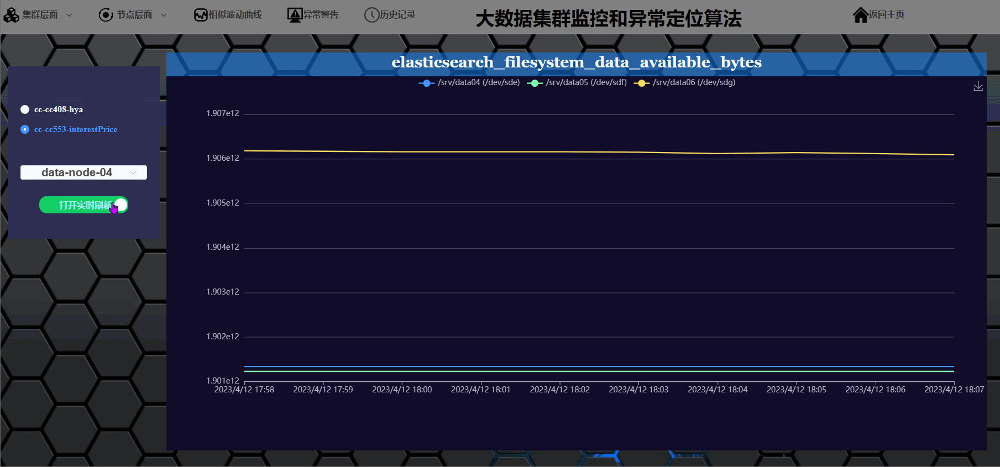

## 安装依赖
```
cd myapp-frontend
npm install

cd myapp-backend
pip install -r requirements.txt
```

## 启动后台服务器
```
cd myapp-backend
python main.py

或：
cd myapp-backend
python db.py(创建数据库，只需在第一次部署时执行)
python main_db.py

详见./myapp-backend/README.md
```

## 启动前端
```
cd myapp-frontend
npm run serve
```

## 端口号说明
```
后台默认端口号：2020
前端默认端口号：8080
```

## 效果示例
<div align=center></div>
