# 时间序列相似性度量

## Euclidean Distance (ED)——欧氏距离
ED的计算方法就是在每个时间段将Q的值减去C的值，再把这些值加起来，由于会有正负的问题会相互抵消，所以我们会用平方距离或者用绝对值。

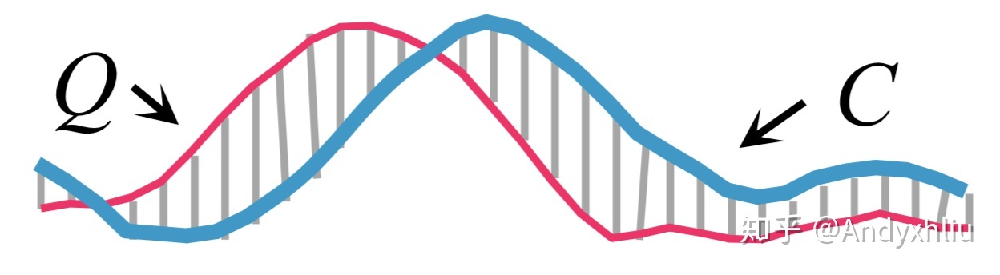

## Dynamic Time Warping (DTW)

### 算法介绍
相对于ED算法，时间序列Q和时间序列C之间不再是一一对应的了，也不是单纯地将同一时间段上的Q(i)-C(i)， 而是会寻找到一组最匹配的点，求二者之间的距离。

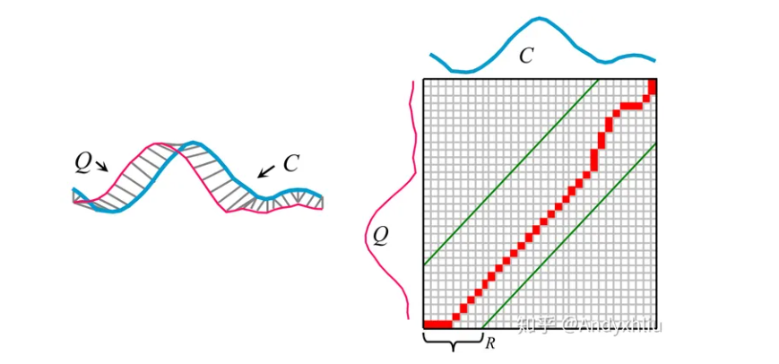

该算法主要借助Dynamic Programming(动态规划)实现。首先，我们如下图右建立一个Matrix(我们称该Matrix为"DA")，y轴是时间序列Q，长度是N，x轴是时间序列C，长度是M，因此是个NxM的matrix。这个matrix上的左下角就是Q的第一个时间段的值，Q(1)，和C的第一个时间段的值，C(1)，的绝对差。而右上角的点是Q的最后一个时间段的值，Q(N)，和C的最后一个时间段的值，C(M)，的绝对差。DTW就是需要求从左下角的起点到右上角的终点，如何匹配才能让总距离最短(注意：Q的起点需要匹配C的起点，Q的终点需要匹配C的终点，其余的点由匹配程度确定)，也就是找到一条从起点到终点的使总距离最短的‘路径‘（warping path）。

动态规划的递推公式如下：

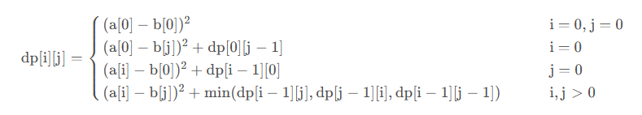

借助动态规划算法得到的最佳路径也应满足下列条件：
- 边界性：两个经DTW对齐的时间序列应该首对首、尾对尾相连；
- 连续性：每次warping path向下一步移动必须是连续的，反映到距离矩阵中就是下一步只能在原方格的相邻方格中选取；
- 单调性：两个时间序列间的对应必须按照顺序进行，warping path不能有交叉。

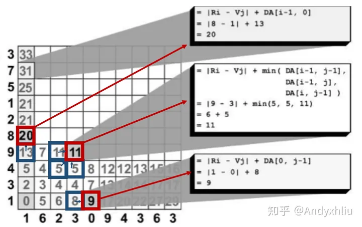

### DTW面临的问题及其解决方案
DTW会在对齐时产生不自然的扭曲/翘曲，如下图所示DTW没能自然地将图形中的波峰与波峰相对应，反而产生了一个序列中的一个点对应另外一个序列中的多个点的情况，这种情况被称为“Singularities”。之所以会产生这个问题，本质上是由于DTW算法本身所考虑的特征决定的——只考虑数据点在Y轴上的值，两个数据点a和b的值相同，但是a位于一个时间序列的上升趋势部分，而b位于一个时间序列的下降趋势部分。对于DTW而言，很容易将这两个点匹配在一起，因为它们的值相同。然而，从直觉上来说，我们很难把两个趋势相反的部分匹配在一起。

归根结底，“Singularities”问题在某种程度上就源于只考虑Y轴的值，第一个序列上的一个点可以跟第二个序列上的另一个很远（此处“远”指的是X轴的距离/序数）的点匹配起来，加上DTW中warping path的连续性、单调性条件，造成了时序数据对齐过程中的各种翘曲/扭曲

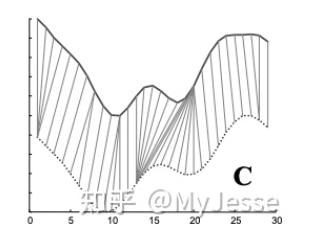

为了解决“Singularities”问题，衍生出两个DTW算法的两个变种：

1. **Derivative Dynamic Time Warping (DDTW)**
   
    DDTW不考虑数据点的Y轴的值，而是考虑更高层次的特征——时序数据的“形状”；相对于传统的DTW，距离矩阵中的元素即为两个点Y轴之间的距离，此时“距离矩阵”中的元素变成了时序数据在两点处一阶导数的差值的平方，DDTW中的一阶导数估计采用以下方法：
    
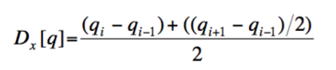

    这种一阶导数的估计方法无法计算时序数据的第一个数据点和最后一个数据点的一阶导数，在实际操作时可以用第二个数据点和倒数第二个数据点的导数来替代。此外，对于高噪声的数据集可以在估计一阶导数之前先做exponential smoothing。

2. **Weighted Dynamic Time Warping (WDTW)**

    与DDTW通过考虑“形状”利用估计时序数据的一阶导数来解决这个问题不同，WDTW选择在计算两个序列上的两个点之间欧氏距离时加上一个weight，而这个weight与两个点之间的X轴上的距离有关系，具体如下所示：
    
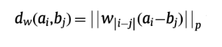

    当weight是一个常数的时候，此时的WDTW对于X轴上距离不同的点的惩罚是相同的，所以等同于传统的DTW；当weight 的值极大时，此时的WDTW对于X轴上距离不同的点惩罚也极大，甚至第i个点和第i-1个点的匹配也不行，此时的WDTW即对应传统的欧氏距离。

DTW采用动态规划来计算两个时间序列之间的相似性，其算法复杂度为O($N^2$)，因此当两个时间序列都比较长时，DTW算法效率比较慢，不能满足实际需求，为此，如何提高 DTW 算法的效率成为一个热门的方向。
1. **DTW 常用加速手段**
    -  约束 – 限制在成本矩阵中评估的单元数，减少 D 的搜索空间，如下图所示，其中中阴影部分为实际的探索空间，而空白的部分不进行探索。缺点：当全局最优解不在阴影搜索区域内时，就会有误差；另外，如果时间序列是在完全不同的时间开始和停止的事件，则约束效果不佳。
    
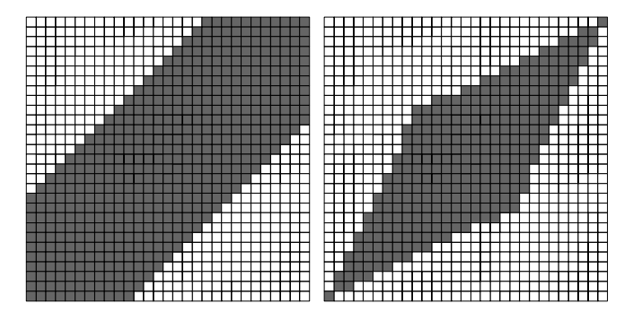

    - 数据抽象 — 对数据的简化表示执行 DTW，如下图所示，就是在低分辨率的矩阵中求解，会存在误差，因为路径不够细化，并且随着抽象级别的增加，路径变得越来越不准确，因此不适用于局部变化剧烈的序列。
    
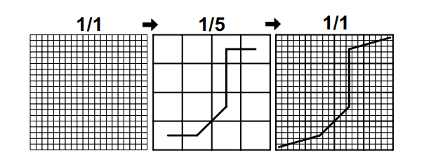

2. **FastDTW**
FastDTW综合使用限制和数据抽象两种方法来加速DTW的计算，由于采取了减少搜索空间的策略，FastDTW 并不一定能够求得准确的DTW距离，但是 FastDTW 算法的时间复杂度比较低，为O(N)，主要分为三个步骤：
* 粗化 —— 将时间序列缩小为更小的时间序列，以更少的数据点尽可能准确地表示相同的曲线。
* 投影 —— 在较低分辨率下找到最小距离扭曲路径，并将其用作更高分辨率最小距离扭曲路径的初始猜测。
* 细化 —— 将在较粗粒度上得到的归整路径经过的方格进一步细粒度化到较高分辨率的时间序列上。除了进行细粒度化之外，我们还额外的在较高分辨率的空间内额外向外(横向，竖向，斜向)扩展K个粒度，K为半径参数，一般取为1或者2。

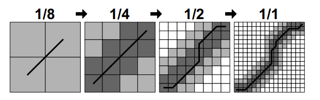

其实在实际使用中，我们发现该算法对周期序列的距离计算不是很好，尤其两个序列是相同周期，但是是平移后的序列，例如：

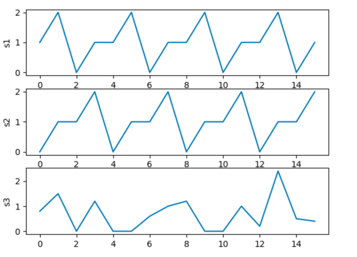

如上图所示，s2和s1是相同的时间序列，其中s2是由s1平移得到的，而s3是随机生成的序列，如果使用经典的DTW算法计算，会得到s3的s1的相似度高于s2和s1的相似度这一错误结论，因此需要对传统的DTW算法进行改进。

主要目的是设置一个惩罚系数$\alpha$，这个$\alpha$和传统算法计算得到的distance相乘，得到更新后的distance。下面给出两种$\alpha$设置的策略：

- 改进策略一：基于最优路径拐点的数量和对角直线的长度，设置$\alpha$如下。其中seqLen是这个图中最优路径节点个数，comLen_i表示每段对角直线的长度。求和后开方表示一个长度系数，这个长度系数越大，表示对角直线越长。最后1减去这个长度系数得到我们要的衰减系数$\alpha$。

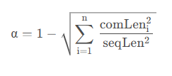

- 改进策略二：基于两个时间序列的最长公共子串的长度，设置$\alpha$如下。由于时间序列是数值序列，因此在求最长公共子串时，设置了一个最大标准差的偏移容忍。也即两个数值的差在这个标准差内，则认为也是公共子串中的一部分。

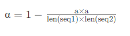

## 波动相似性算法的对比分析

### 性能对比

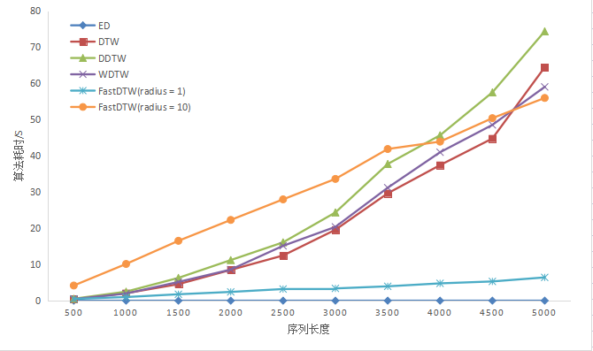

如上图所示，相较于各类 DTW 算法，通过欧式距离来度量各条序列相似程度的方法计算过程十分简单，因此算法耗时很少；而在 DTW 算法中，传统的 DTW 算法以及它的两种优化算法 DDTW 与 WDTW 的算法耗时随着序列长度的增加呈现指数形式的增长；对于 FASTDTW 算法，随着实践序列的增长越来越接近线性时间复杂度，通过上图不难发现，在序列长度较短时，radius 设置为 10 的 FASTDTW 算法在性能上是劣于传统的 DTW 算法的，但是随着序列长度不断增加，FASTDTW 算法的优势渐渐体现了出来，当序列长度达到 5000 时，FASTDTW算法在性能上实现了反超；而在 FASTDTW 算法的内部实现中，其执行的性能很大程度上取决于 radius 半径设置的大小，如果 radius 设置的较小，那么算法所需遍历的窗口就会偏小，那么性能就会提升，但是算法预测的精度也会下降；相反，如果 radius 设置过大，那么算法所需遍历的窗口大小就会更接近传统的 DTW 算法，那么其在性能上就无法体现出较大的优势，但是算法预测的精度会得到一定的提高，所以在实际的开发中，我们需要权衡性能和精度，设置合适的 radius 。

### 精度对比
将上述算法应用于本次项目的异常曲线分析中，各个算法得到的与异常曲线最相似的时间序列如下图所示：

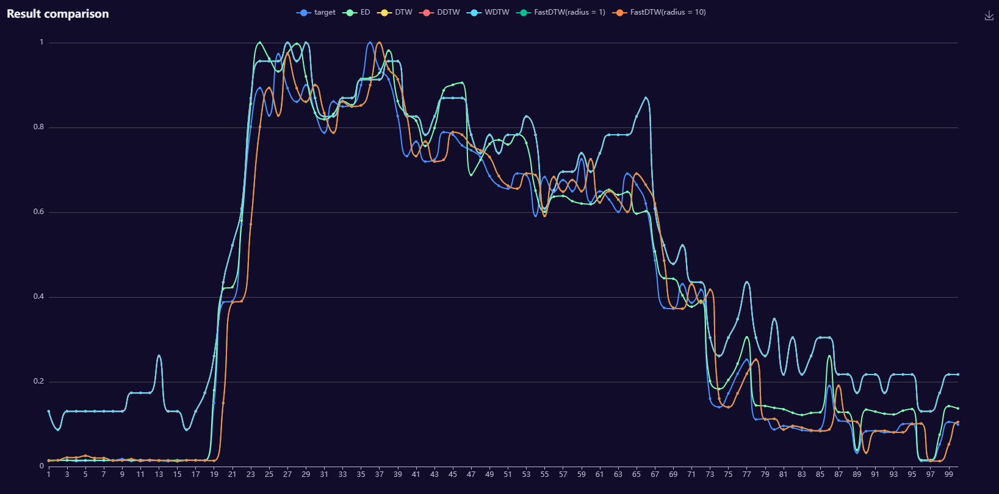

其中 DTW 算法以及它的两种优化算法 DDTW 和 WDTW 算法得到的最相似时间序列一致：

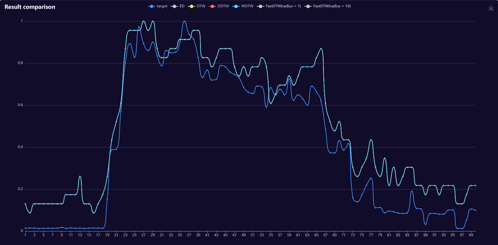

FastDTW(radius = 1) 和 FastDTW(radius = 10) 算法得到的最相似时间序列一致：

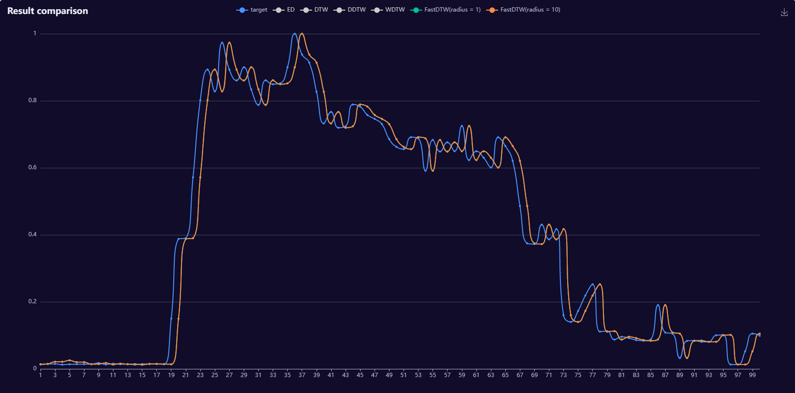

ED 算法得到的最相似时间序列区别于上述两类算法;

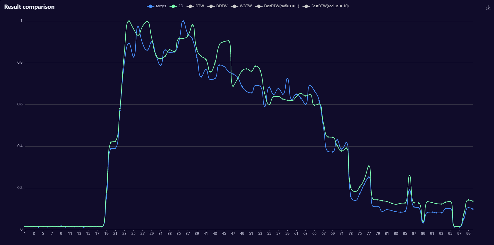

结合上述图片不难看出，FastDTW 算法得到的时间序列与目标序列最为接近，其充分考虑了时间序列存在的平移问题，ED 算法就无法捕捉到序列之间在水平方向上的横向移动，所以得出的时间序列和目标序列相差比较大；而传统的 DTW 算法以及它的两种优化算法在本次实验中表现得并不好，我猜测受到了序列中一些局部极端值的影响，使得它对最终的预测产生偏差。

## Reference
1. https://zhuanlan.zhihu.com/p/87220879
2. https://blog.csdn.net/xsdxs/article/details/86648605
3. https://zhuanlan.zhihu.com/p/389388258
4. https://zhuanlan.zhihu.com/p/119059326
5. https://github.com/pollen-robotics/dtw
6. https://blog.csdn.net/KPer_Yang/article/details/126678842
7. https://www.cnblogs.com/kemaswill/archive/2013/04/18/3029078.html