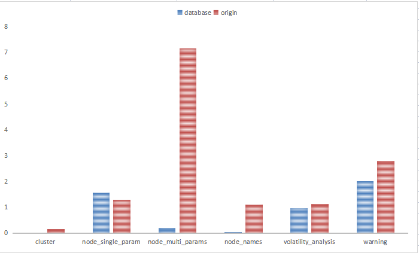

# 后端框架介绍

## 介绍
本项目是基于 Flask 搭建的后端框架，主要负责对不同指标的监控数据进行处理加工，并为前端的三大功能模块
（监控数据展示、告警界面和波动相似性分析）提供相应的后端接口。

本次项目的后端开发主要分为了三个阶段：初期开发、测试阶段以及最后的维护阶段；在初期开发过程中，由于开发时间比较紧张，
所以我当时并没有太在意后端对数据处理的效率，从而导致网页前端对后端发送数据请求时响应时间过长，造成用户体验不佳；
这个问题在项目的测试阶段被展现得比较突出，因此在项目最后的维护中，如何提高后端数据处理的效率是我需要率先解决的。

我的解决方案是将原始的监控数据导入数据库中，摒弃之前通过直接读取表格文件获得监控数据的方式，改为从数据库中读取数据，
使得后端对数据处理的效率得到了很大的提升，如下图所示：

<div align=center></div>

不难发现，引入数据库之后，后端对于数据的处理效率得到了很大的提升，特别是对于从复杂的数据中筛选数据，比如上述柱状图中
 node_multi_params（节点层面多指标数据），借助数据库获取数据相较于从大量表格文件中筛查、搜集数据，具有非常大的性能优势。

## 目录介绍
- data 文件夹：存放本次项目的原始监控数据文件；
- database 文件夹：存放项目所需的数据库文件；
- DTW 文件夹：波动相似性算法调研综述与对比分析；
- db.py：将原始数据导入数据库中，并在 database 文件夹下生成对应的数据库文件；
- main.py：未引入数据库的后端文件，核心的数据处理逻辑是通过读取相应的表格文件获得前端需要的数据；
- main_db.py：引入数据库的后端文件（也是最终提交的版本）；
- compare 文件夹：
    - test.py：用于对比分析两个版本的后端数据处理效率的脚本文件；
    - compare.xlsx：效率对比表格；
    - compare.png：效率对比图。
    
## 后端环境
```
re
sqlite3
Flask       2.3.1
numpy       1.22.4（Numpy最近刚出了2.0版本，使用最新的版本会出错）
pandas      1.3.0   
pathlib     1.0.1
```

## 启动后端
```
# 启动引入数据库的后端程序
python main_db.py

# 启动初始版本的后端程序
python main.py
```
